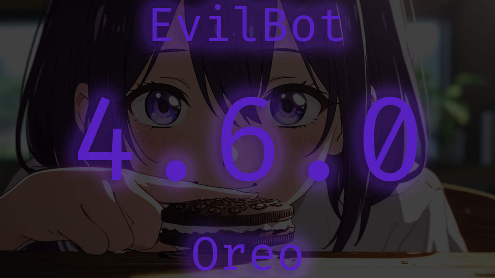

 

  <h1 align="center">Evilbot 4.6.0 (Oreo)</h1>

  

    Official discord bot for Eviloma server
     
     
    
     
     
    <a href="https://github.com/Eviloma/evilbot/issues">Report Bug</a>
    .
    <a href="https://github.com/Eviloma/evilbot/issues">Request Feature</a>
  

 
 

## Table Of Contents

- [Table Of Contents](#table-of-contents)
- [About The Project](#about-the-project)
- [Commands](#commands)
  - [Fun](#fun)
  - [Music](#music)
  - [Setup](#setup)
  - [Other](#other)
- [Built With](#built-with)
- [Roadmap](#roadmap)
- [Contributing](#contributing)
  - [Creating A Pull Request](#creating-a-pull-request)
- [License](#license)

## About The Project

This Discord bot, developed in TypeScript, leverages the power of the discord.js library for seamless interaction with the Discord API. It boasts a diverse range of functionalities tailored to enhance the user experience within your server:

- **Music Playback**: Elevate your server's atmosphere with the bot's impressive music playback capabilities. Integrated with Lavalink, the bot allows users to play music effortlessly. Whether you provide a direct track link or specify keywords for a music search, the bot ensures a smooth and enjoyable listening experience.
- **Welcome New Members**: Foster a sense of community by automatically welcoming new members to your server. The bot takes care of this with a personalized greeting in a designated text channel, ensuring that newcomers feel right at home from the moment they join.
- **Role Assignment on Entry**: Streamline server organization by having the bot assign specific roles to new members upon entry. This feature not only adds a layer of customization to your server structure but also helps in quickly integrating new members into specific community segments.
- **Slash Commands**: Stay on the cutting edge of Discord interaction with the integration of Discord Slash Commands. These commands provide users with a convenient and intuitive way to engage with the bot, making interactions smoother and more user-friendly.
- **Temporary Voice Chats**: Take communication to the next level with the addition of temporary voice chats. Users can create and join voice channels for temporary discussions or activities, adding a dynamic and spontaneous element to your server's voice communication experience.
- **Fun Image Filters Command**: Inject a dose of fun and creativity into your server with the bot's image filter command. Users can apply various entertaining and amusing filters to their images, sparking creativity and laughter within the community.
- **Persistent Storage with PostgreSQL**: All these settings are securely stored in a PostgreSQL database, ensuring persistence across bot restarts. This not only facilitates easy configuration but also provides a reliable and scalable solution for managing server-specific settings.

## Commands

- `[Param]` - Required params
- `<Param>` - Optional params

### Fun

- `/affected <member>` - create affected mem with member avatar
- `/beautiful <member>` - create beautiful mem with member avatar
- `/facepalm <member>` - create facepalm mem with member avatar
- `/fused [member1] <member2>` - mix avatars of two members
- `/hitler <member>` - create worst than hitler mem with member avatar
- `/kiss [member1] <member2>` - create kiss mem with 2 members avatar
- `/rainbow <member>` - create rainbow mem with member avatar
- `/rip <member>` - create rip mem with member avatar
- `/slap [member1] <member2>` - create slap mem with 2 members avatar
- `/spank [member1] <member2>` - create spank mem with 2 members avatar
- `/trash <member>` - create trash mem with member avatar

### Music

- `/filter <filter>` - apply filter to the player
- `/loop <mode>` - toggle loop mode (off, track, queue)
- `/pause` - pause player
- `/play <query>` - play query
- `/queue` - show queue
- `/resume` - resume player
- `/skip` - skip current track
- `/stop` - stop player
- `/volume <number>` - change volume (0-100)

### Setup

- `/setup show` - show setup
- `/setup global-channel [channel]` - set global channel (must be a text channel). If no channel is specified, the current global channel will be removed
- `/setup join-role [role]` - set role for member join. If no role is specified, the current join role will be removed
- `/setup join-to-talk-channel [channel]` - set Join To Talk Channel (must be a voice channel). If no channel is specified, the current Join To Talk Channel will be removed
- `/setup music-channel` - set music channel (must be a text channel). If no channel is specified, the current music channel will be removed
- `/setup temp-voice-channels-category` - set temp voice channels category (must be a category). If no category is specified, the current temp voice channels category will be removed

### Other

- `/clear [number]` - clear messages in channel (default 10)
- `/ping` - show bot ping

## Built With

- [Typescript](https://www.typescriptlang.org/)
- [Bun](https://bun.sh/)
- [Discord.js](https://discord.js.org/)
- [Poru](https://github.com/parasop/poru)
- [Canvacord](https://canvacord.js.org/)
- [Drizzle ORM](https://orm.drizzle.team/)

## Roadmap

See the [open issues](https://github.com/Eviloma/evilbot/issues) for a list of proposed features (and known issues).

## Contributing

Contributions are what make the open source community such an amazing place to be learn, inspire, and create. Any contributions you make are **greatly appreciated**.

- If you have suggestions for adding or removing projects, feel free to [open an issue](https://github.com/Eviloma/evilbot/issues/new) to discuss it, or directly create a pull request after you edit the _README.md_ file with necessary changes.
- Please make sure you check your spelling and grammar.
- Create individual PR for each suggestion.
- Please also read through the [Code Of Conduct](https://github.com/Eviloma/evilbot/blob/main/CODE_OF_CONDUCT.md) before posting your first idea as well.

### Creating A Pull Request

1. Fork the Project
2. Create your Feature Branch (`git checkout -b feature/AmazingFeature`)
3. Commit your Changes (`git commit -m 'Add some AmazingFeature'`)
4. Push to the Branch (`git push origin feature/AmazingFeature`)
5. Open a Pull Request

## License

Distributed under the MIT License. See [LICENSE](https://github.com/Eviloma/evilbot/blob/main/LICENSE.md) for more information.
